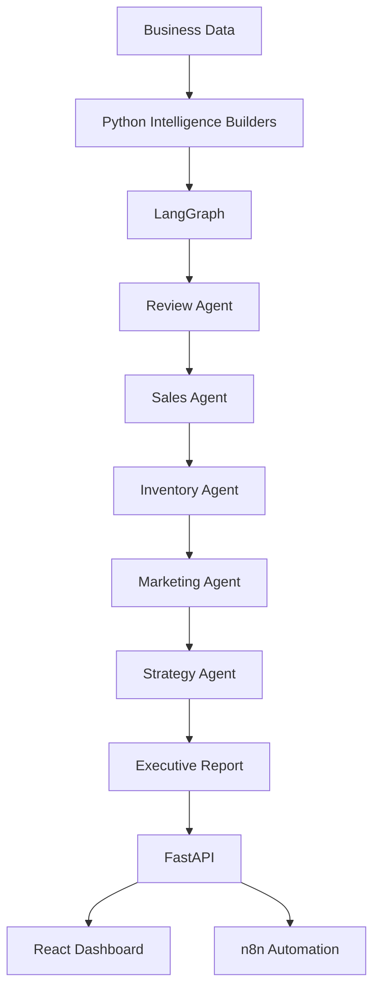
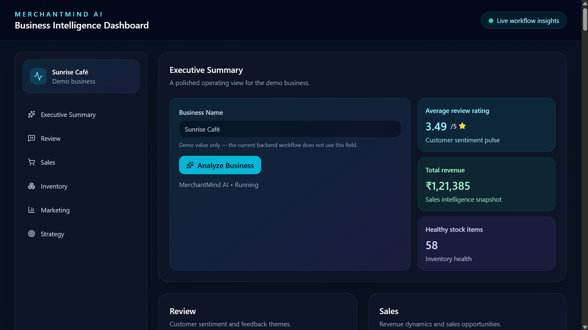
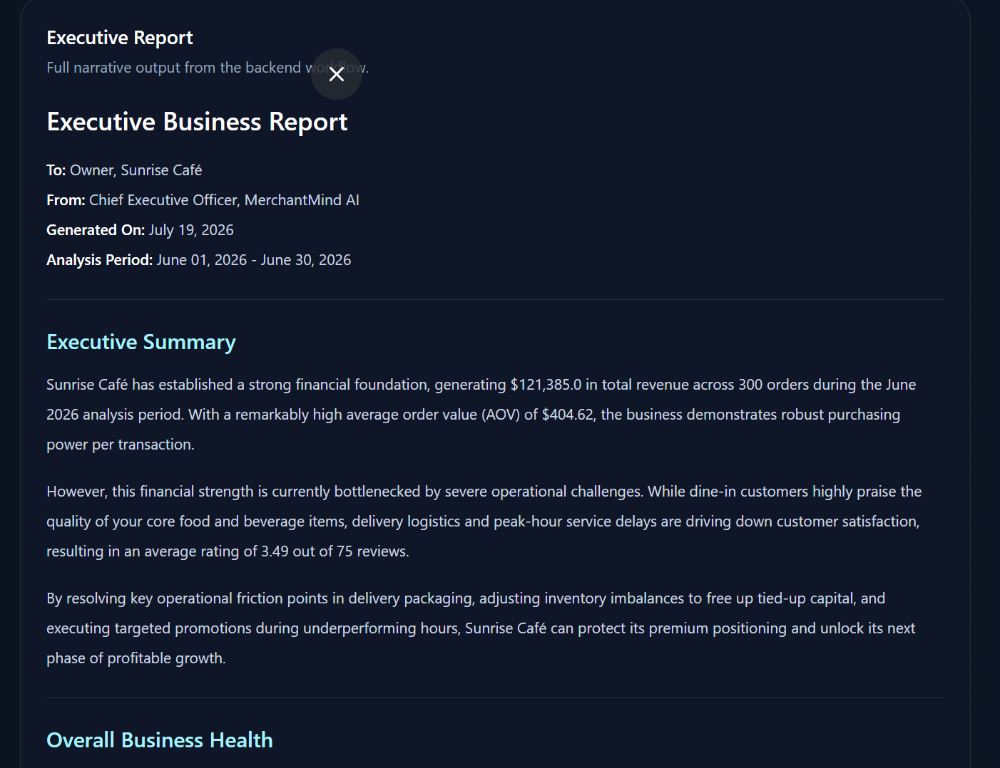

# ☀️ MerchantMind AI


> An AI-powered Business Manager that combines deterministic business intelligence, multi-agent reasoning, and workflow automation to help small businesses make smarter operational decisions.

MerchantMind AI is a multi-agent AI platform that helps small businesses make smarter business decisions through autonomous AI agents.

Instead of acting as a chatbot, MerchantMind AI coordinates multiple specialized AI agents that analyze different aspects of a business and produce actionable insights.

---

## 🌍 Problem

Small businesses often lack access to expensive business consultants, analysts, and marketing experts.

MerchantMind AI aims to bridge this gap by providing an AI-powered business manager capable of analyzing customer feedback, sales, inventory, and overall business performance.

---

## 🎯 Vision

Build an AI operating system for small businesses where multiple AI agents collaborate to improve business growth.

Target businesses include:

- ☕ Cafés
- 🍕 Restaurants
- 🥐 Bakeries
- 🏋️ Gyms
- 💇 Salons
- 🛒 Retail Stores
- 🩺 Clinics
- 📚 Bookstores
- 🔧 Repair Shops

---

# 🌱 UN Sustainable Development Goal

MerchantMind AI aligns with the selected United Nations Sustainable Development Goal by helping small businesses make better operational decisions through AI-powered analytics and workflow automation, enabling more sustainable growth and resource utilization.

---

## 🏛️ Architecture



---

# ⚙️ How It Works

1. Business datasets are loaded.
2. Python generates structured business intelligence.
3. LangGraph orchestrates specialized AI agents.
4. Each agent analyzes one business domain.
5. The Executive Report Agent combines all insights.
6. Results are served through FastAPI.
7. The React dashboard visualizes the analysis.
8. Automation workflows can periodically trigger analysis and notify the business owner.

---


# 🚀 Current Features

### Backend

- ✅ FastAPI REST API
- ✅ LangGraph Multi-Agent Workflow
- ✅ Provider Fallback (Gemini → Groq)
- ✅ Structured Intelligence Builders
- ✅ Customer Review Analysis
- ✅ Sales Analysis
- ✅ Inventory Analysis
- ✅ Marketing Planning
- ✅ Business Strategy Generation
- ✅ Executive Report Generation
- ✅ Modular Prompt Architecture
- ✅ Logging & Exception Handling

### Frontend

- ✅ React Dashboard
- ✅ Responsive SaaS UI
- ✅ Markdown Executive Report Rendering
- ✅ API Integration
- ✅ Loading & Error States

### AI

- ✅ Multi-Agent Collaboration
- ✅ Structured Business Insights
- ✅ Executive Business Summary

---

# 🔄 Current Workflow
The multi-agent pipeline currently runs as:

Chief Business Officer
        ↓
Review Agent
        ↓
Sales Agent
        ↓
Inventory Agent
        ↓
Marketing Agent
        ↓
Strategy Agent
        ↓
Executive Report Agent

**Official Demo Business:**
- Sunrise Café

**Demo Datasets:**
- reviews.json
- sales.csv (300 rows)
- inventory.csv (80 items)

---

# 🤖 AI Agents

### Implemented

- ✅ Chief Business Officer
- ✅ Review Agent
- ✅ Sales Agent
- ✅ Inventory Agent
- ✅ Marketing Agent
- ✅ Strategy Agent
- ✅ Executive Report Agent

### Planned

- 🔄 Competitor Intelligence Agent
- 🔄 Finance Agent
- 🔄 Customer Engagement Agent

---

# 🏗️ Tech Stack

## Backend

- Python
- FastAPI
- LangGraph
- Google Gemini API
- google-genai SDK
- Jinja2
- python-dotenv

## Database (Planned)

- PostgreSQL
- Redis

## Frontend

- React
- Vite
- Tailwind CSS
- Axios
- React Markdown

## Automation

- n8n

## DevOps (Planned)

- Docker
- GitHub Actions

## Others (Planned)
- Authentication
- Multi-business Support

---

# 📂 Project Structure

```text
MerchantMindAI/
│
├── backend/
│   ├── app/
│   │   ├── agents/
│   │   ├── api/
│   │   ├── core/
│   │   ├── graph/
│   │   ├── prompts/
│   │   ├── services/
│   │   ├── tools/
│   │   └── ...
│   │
│   ├── sample_data/
│   └── tests/
│
├── frontend/
│   ├── src/
│   ├── public/
│   └── ...
└── development/     # Local planning (not tracked)
```

---

# 🎯 Current Status

MerchantMind AI is now a complete MVP consisting of:

- Multi-agent backend
- Interactive React dashboard
- Executive report generation
- AI-powered business analysis
- Provider fallback
- Live API integration
- Workflow automation

---

# 📌 Project Status

🟢 MVP Complete

Current Version

v1.0.0-mvp

---

# 📸 Screenshots

### Dashboard



### Executive Report




---

# 👨‍💻 Author

Developed by **Sudarshan Upadhyay**

Project: **MerchantMind AI**

Built as part of an IBM Agentic AI & Automation Workshop while being designed as the foundation for a future SaaS startup.

